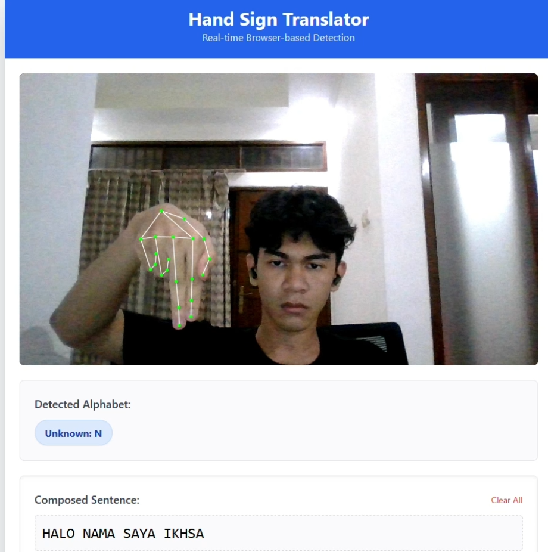

# HandSign Translator - Real-time AI Hand Sign Recognition

Proyek ini adalah aplikasi web berbasis AI yang dapat menerjemahkan alfabet bahasa isyarat (Hand Sign) secara langsung melalui kamera (webcam). Aplikasi ini memungkinkan pengguna untuk membangun kalimat dengan menahan posisi tangan tertentu.

## 🚀 Deskripsi Proyek
Aplikasi ini menggunakan teknologi Computer Vision untuk mendeteksi titik koordinat tangan (landmarks) dan mengklasifikasikannya menjadi huruf alfabet menggunakan algoritma Machine Learning. Fokus utama proyek ini adalah kemudahan penggunaan, di mana pengguna cukup menyediakan dataset gambar sederhana untuk melatih model sesuai kebutuhan.

## 🛠️ Kegunaan
- **Penerjemah Bahasa Isyarat**: Membantu komunikasi dengan teman-teman tuli atau tunawicara melalui alfabet jari.
- **Pembelajaran AI**: Sebagai contoh implementasi MediaPipe Tasks API dan Machine Learning (Random Forest) pada aplikasi web Flask.
- **Pengetikan Berbasis Isyarat**: Memungkinkan pengetikan kalimat secara otomatis tanpa keyboard (handless typing).

## 🧰 Teknologi & Library yang Digunakan
- **Python**: Bahasa pemrograman utama.
- **Flask**: Framework web untuk antarmuka pengguna dan streaming video.
- **MediaPipe (Tasks API)**: Untuk deteksi 21 titik koordinat (landmarks) tangan secara akurat dan ringan.
- **OpenCV**: Untuk pemrosesan gambar, augmentasi data, dan akses kamera.
- **Scikit-Learn**: Untuk melatih model klasifikasi menggunakan algoritma **Random Forest**.
- **Pandas**: Untuk manajemen data koordinat dalam format CSV.
- **Tailwind CSS**: Untuk tampilan antarmuka web yang modern dan responsif.

## 📂 Struktur File Utama
- `app.py`: Server Flask utama yang menjalankan deteksi real-time.
- `hand_detector.py`: Modul inti untuk deteksi dan normalisasi koordinat tangan.
- `process_dataset.py`: Skrip untuk mengekstrak data koordinat dari folder gambar (dengan fitur augmentasi otomatis).
- `train_model.py`: Skrip untuk melatih model AI dan menyimpannya dalam format `.pkl`.
- `dataset/`: Folder tempat menyimpan gambar dataset (A, B, C, D, dst).
- `templates/index.html`: Tampilan frontend aplikasi.

## 📝 Cara Penggunaan
1. Letakkan foto tangan di folder `dataset/[LABEL]/`.
2. Jalankan `python process_dataset.py` untuk memproses gambar.
3. Jalankan `python train_model.py` untuk melatih AI.
4. Jalankan `python app.py` dan buka `http://localhost:5000` di browser.

---
*Dikembangkan sebagai solusi komunikasi inklusif berbasis Computer Vision.*
*Status dari project yang sedang di kerjakan adalah Ongoing dan masih dalam tahap pengembangan.*

### Contoh hasil deteksi

Berikut contoh hasil deteksi plat nomor yang dihasilkan model:

### DataSet Yang di Ambil Sebagai Model

Berikut Adalah Dataset Yang di gunakan Sebagai Contoh Model:

